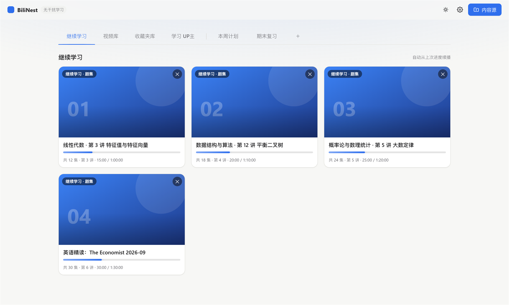

<div align="center">

# BiliNest

**无干扰的 B 站学习播放器：只留你要学的内容，其它全删掉。**

本地优先 · 零依赖（纯 Node 内置模块）· Windows / macOS / Linux · 没有推荐流，也没有广告

[](https://github.com/JLWLIMOU/BiliNest/releases/latest)
[](./LICENSE)
[](https://nodejs.org)
[](#-技术架构)
[](#-快速开始)

[下载](#-下载) · [它解决什么](#-它解决什么问题) · [快速开始](#-快速开始) · [更新](#-更新) · [常见问题](#-常见问题) · [English](#english)

[](https://github.com/JLWLIMOU/BiliNest/releases/latest/download/BiliNest-Setup.exe) [](https://github.com/JLWLIMOU/BiliNest/releases/latest/download/BiliNest-portable.zip)

<sub>Windows 10 / 11 · 不需要管理员权限 · 装过一次之后再运行新安装包会自动按"更新"处理</sub>

</div>



> ⚠️ **非官方项目**：与哔哩哔哩没有任何隶属、合作或授权关系，也不使用其商标与标识。仅供**个人学习自用**；请遵守平台用户协议，勿用于商业用途，勿再分发通过本工具获取的任何内容。

---

## 📦 下载

**普通用户（Windows）**：点下面的直链就是最新版（也可以到 [Releases 页面](https://github.com/JLWLIMOU/BiliNest/releases/latest) 挑特定版本）：

| 下载 | 适合谁 | 说明 |
| :--- | :--- | :--- |
| **[⬇️ BiliNest-Setup.exe](https://github.com/JLWLIMOU/BiliNest/releases/latest/download/BiliNest-Setup.exe)** | 大多数人 | 双击安装，自动建桌面快捷方式。**装过一次之后再运行新安装包，会自动按"更新"处理**：只替换程序文件，数据不动 |
| **[⬇️ BiliNest-portable.zip](https://github.com/JLWLIMOU/BiliNest/releases/latest/download/BiliNest-portable.zip)** | 不想安装 / 用便携软件 / 安装包被杀软误报 | 解压即用，不走安装程序 |

**需要 Node.js 18+**：安装包和启动脚本都会自动检测，没有会给出图文指引（`winget install OpenJS.NodeJS.LTS`，或到 [nodejs.org](https://nodejs.org/zh-cn/download) 下载 LTS 版）。安装时请保持勾选 **Add to PATH**。

**源码版**：`git clone` 后 `npm start`，见 [快速开始](#-快速开始)。

---

## ✨ 它解决什么问题

下面每一组，都是"想用 B 站学点东西"时最容易卡住的那一步。

### 😵‍💫 打开 B 站想看收藏的课，先被推荐流抓走半小时

这个页面里**没有首页、没有推荐流、没有动态、没有热榜、没有评论、没有点赞投币，也没有广告位** —— 打开就是你自己挑的那一个收藏夹。

- **收藏夹锁定**：把某个自己创建的收藏夹设为内容源，进去之后只有它的内容。
- **视频库 / 收藏夹库**：整个收藏夹可以一键入库，夹子里的单个视频也能单独加进视频库；单个视频还支持粘贴链接 / BV 号 / av 号添加。
- **本地视频与文件夹**：选文件是单个视频，选文件夹会**自动解析成一个列表**（按文件名排序，可当合集选集播）。本地文件和 B 站视频用同一个库、同一个播放器。只收浏览器原生能播的格式（mp4 / m4v / mov / webm / mkv）。
- **学习 UP主**：输入 UID 把 UP 主收藏成"追更入口"（头像 / 昵称 / 简介 / 粉丝数 / 星级），点卡片直接去他的主页。

### 🔁 一集看完了，下一集得自己回去找；看着看着还被弹去官网

- **页内播放**：用你自己的登录态取官方自适应码率流，选集面板就在右侧，**播完自动连播下一集**；清晰度切换、弹幕、字幕都在同一个页面里完成，中途不会跳走。播放地址取不到时会自动降级成官方嵌入播放器，而不是给你一个死链。
- **倍速**：控制条直接选档（0.5× – 2.0×），不是 1.0× 时按钮亮成蓝色胶囊；选择会被记住 —— 换集、切清晰度、下次打开还是这个速度。
- **默认值一次设好**：`设置 → 播放` 里定默认清晰度（高 / 中 / 低 / 自动）、默认是否显示弹幕、默认是否开启字幕，以及字幕字号与位置 —— 和播放页控制条是同一份设置，改完立刻生效。
- **弹幕与 CC 字幕**：弹幕用网页端同款的分段接口（比旧接口完整），Canvas 渲染，**只显示不能发送**；字幕是另一套胶囊样式，和弹幕一眼分得开。
- **快捷键**：空格播放 / 暂停、←→ 快退快进、↑↓ 音量、F 全屏、滚轮调音量；进播放页就能用，不必先点一下播放器。

### 🗂️ 收藏夹越攒越乱，想找一集要翻半天

- **卡片**：封面、时长、UP 主、进度、星级一眼看完；没有封面的条目（比如本地文件）会按名字生成一张同色系海报。
- **星级 + 排序 + 搜索**：视频和收藏夹都能打 1–5 星（5 星优先，**还没入库的视频也能打分**）；按添加时间 / 发布时间 / 星级 / 播放量排序；标题行里实时筛选，内容源里还能搜到收藏夹**里面的视频**。
- **自定义标签页**：按主题分组（"线性代数""英语听力"…）。标签栏末尾「＋」新建，双击改名、按住拖动排序，标签多了横向滚动（系统标签固定在左侧）；内容可以从源收藏夹 / 视频库 / 收藏夹库 / 学习 UP主里挑，也可以直接粘贴链接。
- **以收藏夹创建标签页**：收藏夹卡片「⋯」→「以此收藏夹创建标签页」，生成一个「★ 收藏夹名」标签页。它会**跟着源收藏夹走**：源里新增自动补进来、源里删掉跟着移除，而**你自己加进去的内容不受影响**。
- **删除时自己决定动多少**：删标签页、删标签页里的卡片，都可以顺手把视频库里的对应视频一起删掉（不勾就只删这一处）。

### 💾 换台电脑、清一次浏览器，攒的数据就没了

- **数据就在你自己的机器上**：本地服务只监听 `127.0.0.1`，凭据只存在你的浏览器和本机文件里，请求不经过任何第三方服务器。
- **自动备份**：状态会自动备份到 `%APPDATA%\BiliNest\state-backup.json`（macOS / Linux 为 `~/.config/BiliNest/`）；换浏览器、换端口、清过缓存后再打开会**自动取回**，两边都有数据时以较新的那份为准。
- **学习记录**：累计看了多久、连续多少天、打卡热力图、每日 / 每周 / 每月趋势、最常看的内容 —— 入口挂在「继续学习」旁边，不占主界面。
- **不用维护依赖**：本地服务只用 Node 内置模块，前端是手写 HTML/CSS/JS，**不需要 npm install**，也没有隔三差五要升级的依赖树。

---

## 🚀 快速开始

### 1. 装 Node.js（只需一次）

到 [nodejs.org](https://nodejs.org/zh-cn/download) 下载 **LTS** 版安装即可（安装时保持勾选 **Add to PATH**）。Windows 上也可以一条命令：

```powershell
winget install OpenJS.NodeJS.LTS
```

> 没装 Node.js 时，双击启动脚本会自动打开一份图文安装指引。

### 2. 获取程序

```bash
git clone https://github.com/JLWLIMOU/BiliNest.git
cd BiliNest
```

（或者用上面的[安装包 / 便携版](#-下载)，那两种方式不需要这一步。）

### 3. 启动

```bash
# Windows：双击 launcher.vbs（可再用 create-shortcut.ps1 建桌面快捷方式）
# macOS / Linux：
./start.sh
```

浏览器打开 **<http://127.0.0.1:4173>** 即可（端口被占用时会自动顺延，实际端口写在 `bilinest.port`）。

**第一次打开**会自动弹出「使用引导」：先带你扫码登录，再用几页说明内容源、标签页、播放器和学习记录怎么用（可以在 `设置 → 关于 → 查看使用引导` 里重看）。

<details>
<summary>打不开 / 快速排查</summary>

- 页面提示"未检测到本地代理服务"：说明服务没起来 —— 先运行 `npm start`（或双击 `launcher.vbs` / `./start.sh`），再访问 `http://127.0.0.1:4173`。
- 双击快捷方式闪一下就没了：多半是没装 Node.js，见上面的安装指引。
- 端口被别的程序占了：服务会自动换端口，看项目目录里的 `bilinest.port`。
- 想改端口 / 数据目录：设置环境变量 `BILINEST_PORT` / `BILINEST_DATA_DIR`。

</details>

<details>
<summary>直接用 index.html 打开（不推荐）</summary>

直接双击 `public/index.html` 能用一部分功能（浏览视频库、播放本地视频、看学习记录 —— 数据存在浏览器本地），但**没有本地代理**：登录、收藏夹、B 站视频播放都会不可用。想完整使用请按上面的方式启动本地服务。

</details>

---

## 🔄 更新

**推荐：应用内一键更新** —— `设置 → 关于 → 更新`，按钮会显示「检查更新」或「更新到 vX.Y.Z」，点一下确认即可：

- **源码版（git 检出）**：自动 `git pull` → 重启本地服务 → 刷新页面，全程不用开终端（工作区有未提交改动时会中止）。
- **安装版 / 便携版**：本地服务自己下载发布包 → 替换程序文件 → 重启服务 → 页面自动刷新。**不会动你的数据**；下载被网络拦截时会自动改用另一个 GitHub 域名取更新包。

检查方式可以切换：**自动（打开页面时，只在设置图标上点一个小圆点）** 或 **仅手动**。

> **更新通道是从 1.4.5 起才彻底修好的**：1.4.3 / 1.4.4 也能自动下载替换，但遇到代理、或遇到"能开 github.com 却下不动资产 CDN"的线路时仍会失败。所以 **1.4.4 及更早的版本请先手动装一次安装包**，之后就都能一键更新了。

<details>
<summary>手动更新（三条路）</summary>

1. **安装包 / 便携版**：到 [Releases](https://github.com/JLWLIMOU/BiliNest/releases) 下载最新文件 —— 安装包双击覆盖安装（会自动停掉旧服务并重启），便携版解压覆盖到原目录即可。
2. **源码版**：`git pull origin main`，然后重启服务。
3. **覆盖解压**：把新版 ZIP 解压到临时目录，再把文件覆盖到旧目录（替换同名文件），保留你自己的 `.env`，然后重启服务。

**注意事项**

- 你的数据（登录态、视频库、收藏夹库、标签页、观看记录）不在项目文件夹里，更新代码不会丢；但**不要整个文件夹删掉重下**，那会连 `.env` 一起没了。
- `bilinest.port` 是临时文件（记录当前端口），重启后会自动更新；桌面快捷方式不受更新影响。

</details>

---

## 🔐 登录

三种方式，按推荐顺序：

1. **扫码登录（推荐）**：点右上角的**账号状态点**（未登录是灰色）就会直接出二维码，用 B 站 App 扫一下确认即可；也可以在 `设置 → 登录与授权` 里扫码。
2. **手动粘贴 SESSDATA / Cookie**：折叠在"其他登录方式"里；适合扫码总被风控拦截的情况。
3. **OAuth（可选）**：需要自己到 B 站开放平台注册应用，把凭证写进 `.env`（见 `.env.example`），适合自建自用。

> 登录态只用于读取你自己的收藏夹与播放你有权观看的内容；凭据只存在本机。

---

## ❓ 常见问题

<details>
<summary>Mac / Linux 能用吗？</summary>

能。后端是纯 Node 内置模块、前端是标准网页，零原生依赖。macOS / Linux 用 `./start.sh`（或 `npm start`）启动，再访问 `http://127.0.0.1:4173`。只有 Windows 专属的 `launcher.vbs` / `create-shortcut.ps1` 不适用，那只是便利脚本。

</details>

<details>
<summary>收藏夹加载失败 / 返回 -403？</summary>

多为 Cookie 过期：到 `设置 → 登录与授权` 重新登录（或重新粘贴 SESSDATA）并验证一次。私密收藏夹必须用有权限的账号。

</details>

<details>
<summary>提示"请求被风控拦截（412）"或频繁失败？</summary>

B 站对异常频率会风控。放慢节奏、别短时间反复刷新；服务端已做限频（每 10 秒最多 40 次），遇到 412 会用 WBI 签名重试一次。

</details>

<details>
<summary>扫码登录一直失败？</summary>

多为网络波动或该 IP 被风控。稍后重试、点「刷新二维码」，或改用"手动粘贴 SESSDATA"。

</details>

<details>
<summary>开了梯子（代理），为什么应用内更新还是失败？</summary>

因为 **Node 自带的网络请求默认不读系统代理**：浏览器走代理能打开 GitHub，本地服务却是直连。1.4.5 起本地服务会自己找代理并按 **环境变量代理（`HTTPS_PROXY` / `HTTP_PROXY` / `ALL_PROXY`）→ Windows 系统代理（注册表 `ProxyEnable=1` 那套）→ 直连** 的顺序试，哪条通用哪条；全都失败时会逐条说明原因。

- 最常见的情况：把代理软件的"系统代理"开关打开就行（Clash / v2rayN 的"系统代理"就是写注册表那套）。
- **仅 SOCKS 端口**：请在代理软件里改用 **HTTP / 混合端口**（如 Clash 的 `mixed-port`），或设环境变量 `HTTPS_PROXY=http://127.0.0.1:端口`。
- **PAC 脚本**：自动检测不到，建议切到"系统代理（全局 / 规则）"模式，或设上面的环境变量。
- 代理本身连不上 GitHub：会自动退回直连再试一次。

</details>

<details>
<summary>本地视频刷新后要重新授权？</summary>

Chromium 内核浏览器会自动恢复文件权限；被拒就把文件删掉重新添加。其它浏览器仅本次会话可播放。

</details>

<details>
<summary>数据存在哪里？换浏览器 / 清缓存会不会丢？</summary>

平时存在浏览器本地（localStorage），同时自动备份到 `%APPDATA%\BiliNest\state-backup.json`（macOS / Linux 为 `~/.config/BiliNest/state-backup.json`，可用 `BILINEST_DATA_DIR` 改位置）。换浏览器、换端口或清过浏览器数据后打开会**自动取回**；两边都有数据时**以较新的一份为准**，不会用旧快照盖掉新数据。`设置 → 数据` 里可以手动「从备份恢复」或「清除全部本地数据」。

⚠️ 备份文件里是**明文**的登录凭据（SESSDATA）：请不要分享、同步到网盘或上传；共用电脑上建议用完就在「设置 → 数据」里清除。

</details>

<details>
<summary>这样做会违反 B 站用户协议吗？</summary>

如实说明：这类第三方客户端通常**不符合**平台的用户协议与 API 使用规范。本项目的立场是 —— 只在本机、用你自己的账号、播放你自己有权观看的内容；不做下载、不做批量抓取、不绕过付费与会员权益、不把任何数据发给第三方。请自行判断是否使用，风险与后果由使用者承担。

</details>

<details>
<summary>怎么打包成桌面应用？</summary>

本应用就是"静态页面 + 本地服务"，可以用任意壳包装，例如 Electron：

```bash
npm init -y && npm i -D electron
# main.js 里 BrowserWindow.loadURL('http://127.0.0.1:4173')，启动时拉起 node server.mjs
npx electron .
```

</details>

---

## 🧱 技术架构

```text
BiliNest/
├── server.mjs            # 本地代理 + 静态托管 + 状态备份 + 更新检查 + 可选 OAuth（零依赖）
├── bin/bilinest.mjs      # npx 入口（启动服务并打开浏览器）
├── launcher.vbs          # Windows 一键启动（缺 Node 时给安装指引）
├── create-shortcut.ps1   # Windows 桌面快捷方式
├── start.sh              # macOS / Linux 一键启动
├── installer/            # Windows 安装包脚本（Inno Setup）
├── docs/img/             # README 截图（演示数据）
└── public/
    ├── index.html        # 页面骨架（含 CSP）
    ├── styles.css        # 深 / 浅色主题与全部样式
    ├── storage.js        # localStorage 状态管理
    ├── api.js            # B 站 API 客户端（代理优先）
    ├── localfiles.js     # 本地视频：File System Access API + IndexedDB
    ├── player.js         # 播放器：DASH + dash.js + 弹幕 + CC 字幕
    ├── app.js            # 主逻辑：渲染、播放、设置、更新
    └── vendor/           # ArtPlayer v5、dash.js、dash-control、qrcode、uPlot
```

**为什么需要本地代理？** 浏览器直接请求 `api.bilibili.com` 会被 CORS 拦。`server.mjs` 只监听 `127.0.0.1`，转发白名单内的少量**只读**接口（不会变成任意 URL 的开放代理），内置频率限制，遇到 412 用 WBI 签名重试一次；OAuth 会话只存内存，重启即失效。

<details>
<summary>用到的 B 站接口（全部只读）与播放器细节</summary>

| 接口 | 用途 |
| :--- | :--- |
| `x/v2/account/myinfo` | 校验登录、获取 mid / 用户名 |
| `x/v3/fav/folder/created/list(-all)` | 我创建的收藏夹列表 |
| `x/v3/fav/resource/list` | 收藏夹内容 |
| `x/web-interface/view` | 视频详情（分 P / 合集） |
| `x/player/wbi/playurl` | 播放地址（DASH 自适应码率） |
| `x/v2/dm/wbi/web/seg.so` | 弹幕分段（每 6 分钟一包，失败回退旧接口） |
| `x/web-interface/nav` | WBI 密钥来源（仅服务器内部） |

播放器用 **ArtPlayer**（UI / 控件）+ **dash.js**（自适应码率），清晰度菜单由 `artplayer-plugin-dash-control` 从 MPD 码率列表生成；字幕转成 WebVTT 交给 ArtPlayer 原生字幕模块；B 站 CDN 的防盗链由 `/api/video` 代理统一带上正确的 Referer 转发。

</details>

---

## 📄 许可、合规与免责

本项目以 **MIT 许可证**发布（见 [`LICENSE`](./LICENSE)）。

内置的开源组件（许可证文本随文件分发）：

| 组件 | 版本 | 作者 | 许可证 | 用途 |
| :--- | :--- | :--- | :--- | :--- |
| [ArtPlayer](https://github.com/zhw2590582/ArtPlayer) | v5.4.0 | Harvey Zhao | MIT | 页内视频播放器内核 |
| [artplayer-plugin-danmuku](https://github.com/zhw2590582/ArtPlayer) | v5.3.0 | Harvey Zhao | MIT | 弹幕渲染 |
| [dash.js](https://github.com/Dash-Industry-Forum/dash.js) | v4.5.2 | Dash Industry Forum | BSD-3-Clause | DASH 自适应码率引擎 |
| [artplayer-plugin-dash-control](https://github.com/zhw2590582/ArtPlayer) | v1.1.0 | Harvey Zhao | MIT | 清晰度下拉控件 |
| [qrcode-generator](https://github.com/kazuhikoarase/qrcode-generator) | — | Kazuhiko Arase | MIT | 登录二维码 |
| [uPlot](https://github.com/leeoniya/uPlot) | v1.6.32 | Leon Sorokin | MIT | 学习统计图表 |

Windows 安装包用 Inno Setup 6 编译（中文语言文件来自 Inno Setup 官方源码仓库的未收录翻译）。

<details>
<summary>安全与合规声明</summary>

- 代码**不硬编码任何敏感信息**；Cookie / OAuth 密钥全部来自用户输入或环境变量。
- 凭据只存本机（浏览器 localStorage / 内存 / `%APPDATA%\BiliNest`），不发送给任何第三方。
- ⚠️ 备份文件与浏览器 localStorage 中**明文保存**登录凭据（SESSDATA），请勿分享、同步或上传；共用电脑上用完建议清除。
- 本地服务只监听 `127.0.0.1`，不对局域网或公网开放；只转发白名单内的只读接口并做频率限制。
- 请遵守 B 站用户协议与 API 规范，仅限个人学习使用。

</details>

<details>
<summary>免责声明</summary>

本项目为个人开源项目，**与哔哩哔哩没有任何隶属、合作或授权关系**，也不使用其商标与品牌标识。

技术实现如实说明：本工具复用 B 站**网页端同款的只读接口**（包含网页端公开使用的 WBI 签名参数），并在本机转发视频流时按 CDN 要求携带 Referer —— 这些是让"在本机播放自己账号有权观看的内容"能工作所必需的。本工具**不**破解付费 / 会员内容，**不**绕过账号权限，**不**提供下载、批量抓取、去水印或地区限制绕过能力，也不向任何第三方发送你的数据。

第三方客户端通常**不符合**平台的用户协议与 API 使用规范；请自行判断是否使用，因使用本工具产生的任何账号风险（风控、限流、封禁等）由使用者自行承担。

</details>

<details>
<summary>关于本项目（AI 辅助开发）</summary>

本项目以 **AI 辅助开发**方式完成：**需求、评审、逐条实测与发布由作者负责**；代码主要由 **OpenAI Codex** 在作者指导下生成，并经过人工核对 —— 每处改动都跑过浏览器实测或自动化验证（见 [CHANGELOG.md](./CHANGELOG.md) 各条的「验证」）。

Codex 是开发工具，**不是本项目的贡献者、维护者或责任人**；项目的问题与后续维护由作者承担。仅供个人学习交流使用。

</details>

---

## English

**BiliNest** is a distraction-free **Bilibili** study player. It shows only the content you choose — a specific favourite folder, videos you add by link, or local files — with **no home feed, no recommendations, no comments, no like/coin buttons, no ads**. Playback, danmaku and CC subtitles all happen inside the page, and the next episode is already queued up, so nothing pulls you away mid-session.

- **Local-first & private** — a tiny zero-dependency Node proxy on `127.0.0.1` forwards only whitelisted read-only Bilibili APIs. Credentials stay in your own browser and never touch a third-party server.
- **No dependencies** — pure Node 18+ built-ins plus a hand-written frontend: no `npm install` needed.
- **Cross-platform** — Windows, macOS and Linux.
- **Built-in updates** — `Settings → About → Update` pulls the source (git checkout), or downloads and swaps the program files in place (installed/portable), then restarts and reloads the page by itself.
- **Unofficial** — a third-party hobby project, not affiliated with, endorsed by or sponsored by Bilibili. For personal study use only; please respect Bilibili's terms of service.

**Download**: grab the latest `BiliNest-x.y.z-Setup.exe` (or the portable ZIP) from the [Releases page](https://github.com/JLWLIMOU/BiliNest/releases/latest). **Quick start from source**: install Node 18+, then `git clone … && cd BiliNest && npm start`, and open <http://127.0.0.1:4173>.
